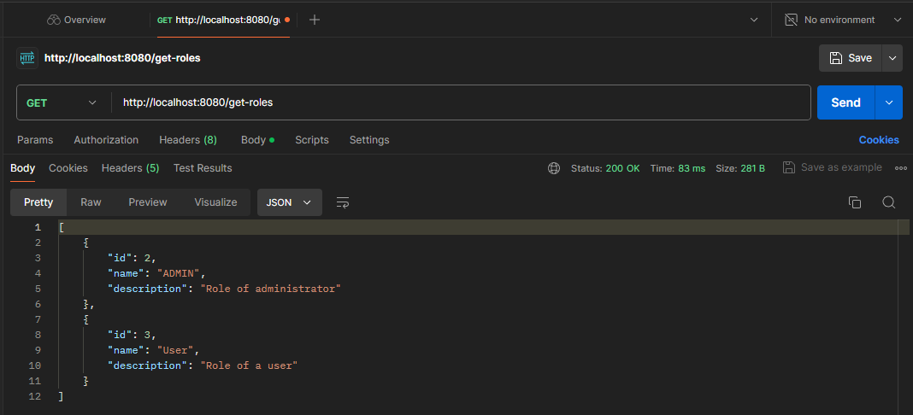
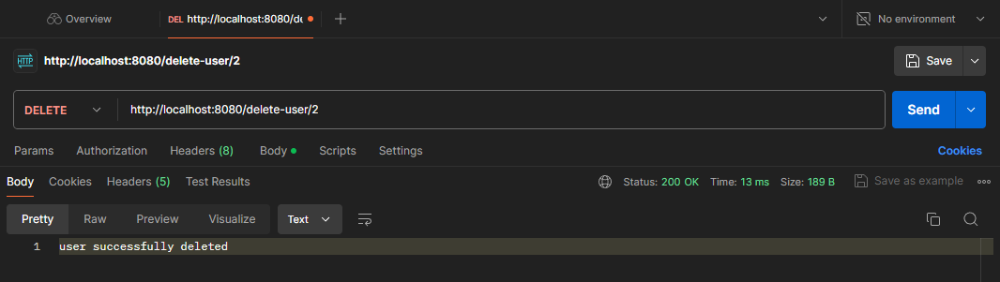

# Тестування працездатності системи

## Role

### Add

  

### Get

  

### Get all

  

### Update

  

### Delete

  

## User

### Add

  

### Get

  

### Get all

    

### Update

    

### Delete

    

